# PPIS User Manual Screenshots

Generated: 2026-06-03T03:32:09.270Z
Application URL: http://localhost/pis/

## Summary

- Screenshots generated: 68
- Pages or states with recorded errors: 2
- Screenshot folder: screenshots

## Screenshot Catalog

### 1. Login

- Purpose: Authenticates a user with username and password before entering PPIS.
- Screenshot Filename: screenshots/001-login.png
- URL: http://localhost/pis/
- Description of visible controls and functions:
  - Buttons/actions: SIGN IN
  - Links/navigation: Sign Up Here
  - Input fields: Email address; ********

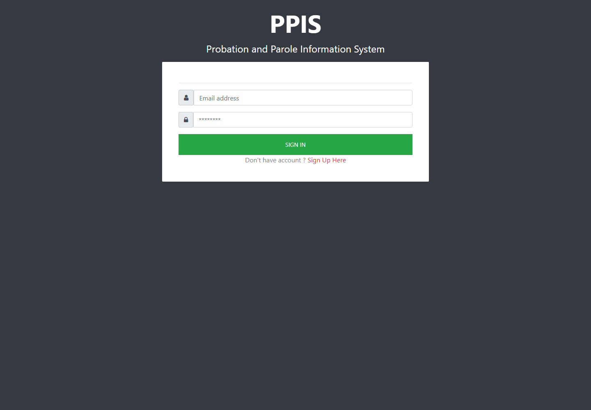

### 2. Investigation Docket List - logged in

- Purpose: Provides a landing view for system activity and logged-in user navigation.
- Screenshot Filename: screenshots/002-investigation-docket-list-logged-in.png
- URL: http://localhost/pis/investigation_docketing
- Description of visible controls and functions:
  - Buttons/actions: Run search
  - Links/navigation: Investigation; Courtesy Investigation; Supervision; Courtesy Supervision; PDL Routing; Forms; Dashboard; Docketing
  - Input fields: Docket Number, CC Number, Name
  - Dropdowns: tblPisInvestigationDockets_length
  - Tables: #, Docket Number, Received Date, Name, Criminal Case No., Field Office, Actions
  - Modals available: Permanently remove docket?
  - Pagination: Previous Next

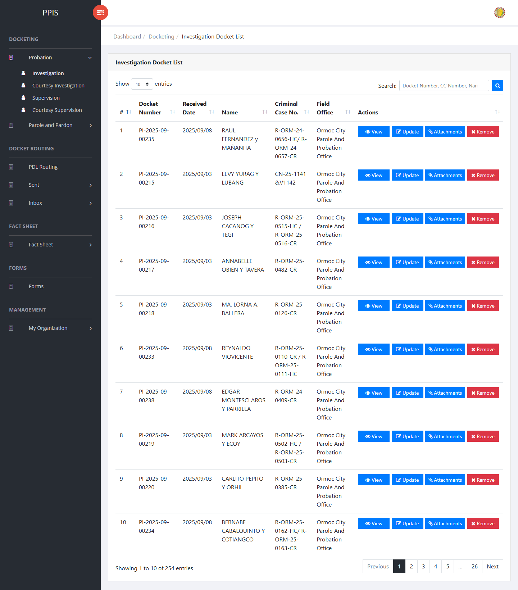

### 3. Main Navigation - expanded menus

- Purpose: Shows the accessible sidebar modules and submenu links for the logged-in user.
- Screenshot Filename: screenshots/003-main-navigation-expanded-menus.png
- URL: http://localhost/pis/investigation_docketing
- Description of visible controls and functions:
  - Buttons/actions: Run search
  - Links/navigation: Investigation; Courtesy Investigation; Supervision; Courtesy Supervision; PDL Routing; PDL; Probation; Parole and Pardone; Forms; User Accounts; User Roles; Field Office
  - Input fields: Docket Number, CC Number, Name
  - Dropdowns: tblPisInvestigationDockets_length
  - Tables: #, Docket Number, Received Date, Name, Criminal Case No., Field Office, Actions
  - Modals available: Permanently remove docket?
  - Pagination: Previous Next

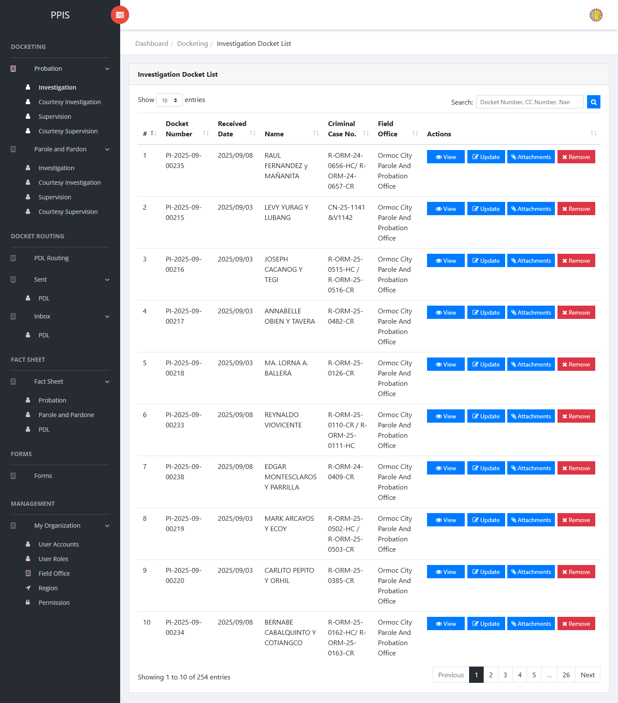

### 4. Investigation Docket List

- Purpose: Provides a landing view for system activity and logged-in user navigation.
- Screenshot Filename: screenshots/004-investigation-docket-list.png
- URL: http://localhost/pis/investigation_docketing
- Description of visible controls and functions:
  - Buttons/actions: Run search; View; Update; Attachments; Remove
  - Links/navigation: Investigation; Courtesy Investigation; Supervision; Courtesy Supervision; PDL Routing; Forms; Dashboard; Docketing
  - Input fields: Docket Number, CC Number, Name
  - Dropdowns: tblPisInvestigationDockets_length
  - Tables: #, Docket Number, Received Date, Name, Criminal Case No., Field Office, Actions
  - Modals available: Permanently remove docket?
  - Pagination: Previous 1 2 3 4 5 … 26 Next

### 5. Investigation Docket List - pagination next page

- Purpose: Shows paginated data after moving to the next page.
- Screenshot Filename: screenshots/005-investigation-docket-list-pagination-next-page.png
- URL: http://localhost/pis/investigation_docketing
- Description of visible controls and functions:
  - Buttons/actions: Run search; View; Update; Attachments; Remove
  - Links/navigation: Investigation; Courtesy Investigation; Supervision; Courtesy Supervision; PDL Routing; Forms; Dashboard; Docketing
  - Input fields: Docket Number, CC Number, Name
  - Dropdowns: tblPisInvestigationDockets_length
  - Tables: #, Docket Number, Received Date, Name, Criminal Case No., Field Office, Actions
  - Modals available: Permanently remove docket?
  - Pagination: Previous 1 2 3 4 5 … 26 Next

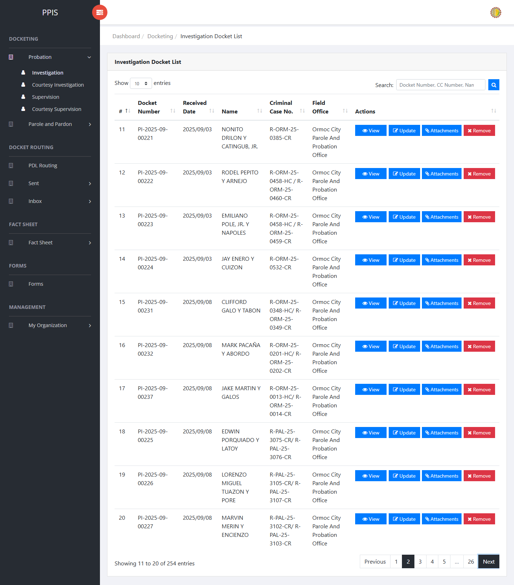

### 6. Investigation Docket List - modal Remove

- Purpose: Shows the Remove modal/dialog state.
- Screenshot Filename: screenshots/006-investigation-docket-list-modal-remove.png
- URL: http://localhost/pis/investigation_docketing
- Description of visible controls and functions:
  - Buttons/actions: Run search; View; Update; Attachments; Remove
  - Links/navigation: Investigation; Courtesy Investigation; Supervision; Courtesy Supervision; PDL Routing; Forms; Dashboard; Docketing
  - Input fields: Docket Number, CC Number, Name
  - Dropdowns: tblPisInvestigationDockets_length
  - Tables: #, Docket Number, Received Date, Name, Criminal Case No., Field Office, Actions
  - Modals available: Permanently remove docket?
  - Pagination: Previous 1 2 3 4 5 … 26 Next

### 7. Investigation Docket List - modal Remove

- Purpose: Shows the Remove modal/dialog state.
- Screenshot Filename: screenshots/007-investigation-docket-list-modal-remove.png
- URL: http://localhost/pis/investigation_docketing
- Description of visible controls and functions:
  - Buttons/actions: Run search; View; Update; Attachments; Remove
  - Links/navigation: Investigation; Courtesy Investigation; Supervision; Courtesy Supervision; PDL Routing; Forms; Dashboard; Docketing
  - Input fields: Docket Number, CC Number, Name
  - Dropdowns: tblPisInvestigationDockets_length
  - Tables: #, Docket Number, Received Date, Name, Criminal Case No., Field Office, Actions
  - Modals available: Permanently remove docket?
  - Pagination: Previous 1 2 3 4 5 … 26 Next

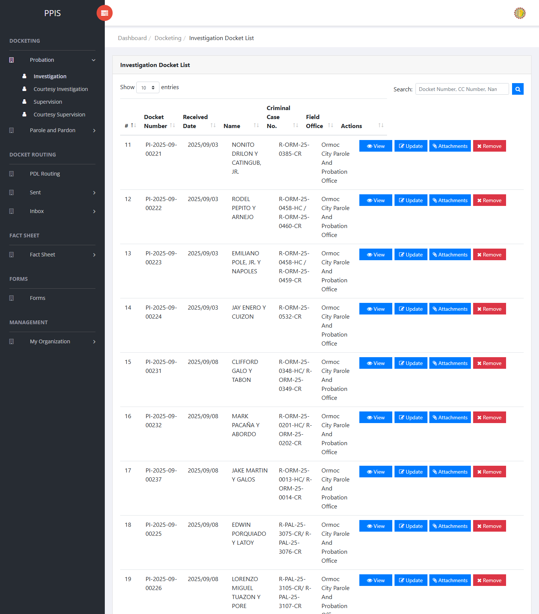

### 8. Courtesy Investigation Docket List

- Purpose: Provides a landing view for system activity and logged-in user navigation.
- Screenshot Filename: screenshots/008-courtesy-investigation-docket-list.png
- URL: http://localhost/pis/probation-courtesy-investigation-list
- Description of visible controls and functions:
  - Buttons/actions: Run search; View; Update; Attachments; Remove
  - Links/navigation: Investigation; Courtesy Investigation; Supervision; Courtesy Supervision; PDL Routing; Forms; Dashboard; Docketing
  - Input fields: Search docket / name
  - Dropdowns: tblCourtesyInvestigationDockets_length
  - Tables: #, Docket Number, Date Completed and Returned, Name, Field Office, Actions
  - Modals available: Permanently remove docket?
  - Pagination: Previous 1 2 3 Next

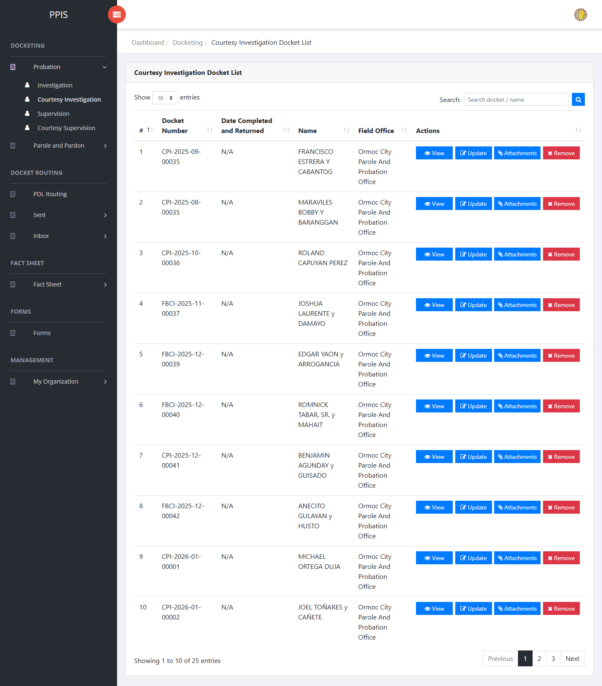

### 9. Courtesy Investigation Docket List - pagination next page

- Purpose: Shows paginated data after moving to the next page.
- Screenshot Filename: screenshots/009-courtesy-investigation-docket-list-pagination-next-page.png
- URL: http://localhost/pis/probation-courtesy-investigation-list
- Description of visible controls and functions:
  - Buttons/actions: Run search; View; Update; Attachments; Remove
  - Links/navigation: Investigation; Courtesy Investigation; Supervision; Courtesy Supervision; PDL Routing; Forms; Dashboard; Docketing
  - Input fields: Search docket / name
  - Dropdowns: tblCourtesyInvestigationDockets_length
  - Tables: #, Docket Number, Date Completed and Returned, Name, Field Office, Actions
  - Modals available: Permanently remove docket?
  - Pagination: Previous 1 2 3 Next

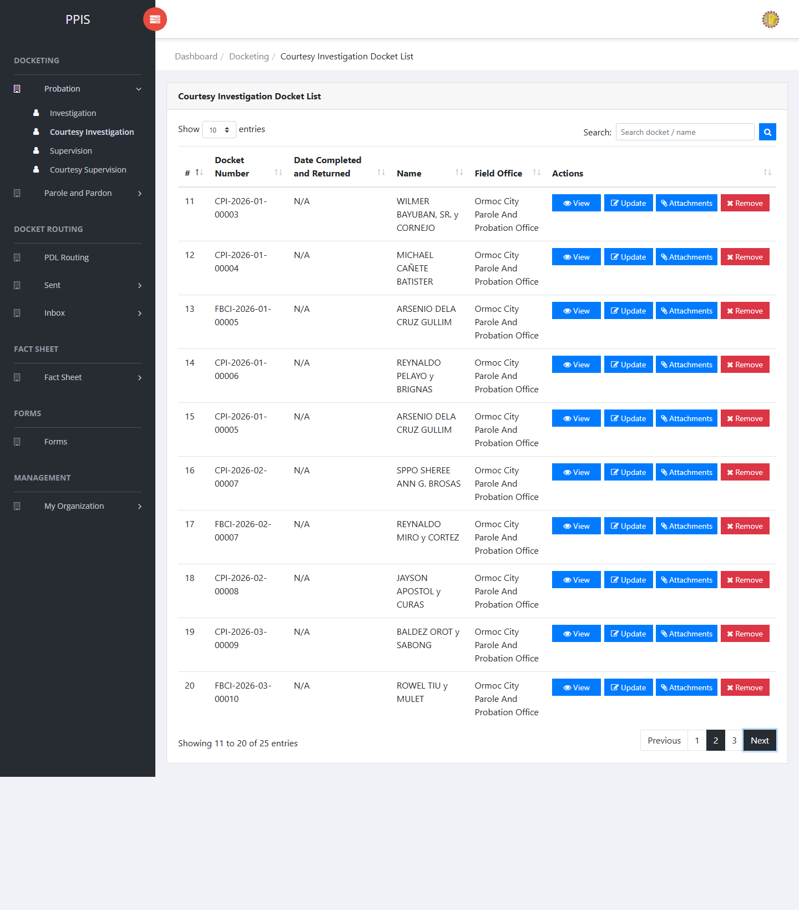

### 10. Courtesy Investigation Docket List - modal Remove

- Purpose: Shows the Remove modal/dialog state.
- Screenshot Filename: screenshots/010-courtesy-investigation-docket-list-modal-remove.png
- URL: http://localhost/pis/probation-courtesy-investigation-list
- Description of visible controls and functions:
  - Buttons/actions: Run search; View; Update; Attachments; Remove
  - Links/navigation: Investigation; Courtesy Investigation; Supervision; Courtesy Supervision; PDL Routing; Forms; Dashboard; Docketing
  - Input fields: Search docket / name
  - Dropdowns: tblCourtesyInvestigationDockets_length
  - Tables: #, Docket Number, Date Completed and Returned, Name, Field Office, Actions
  - Modals available: Permanently remove docket?
  - Pagination: Previous 1 2 3 Next

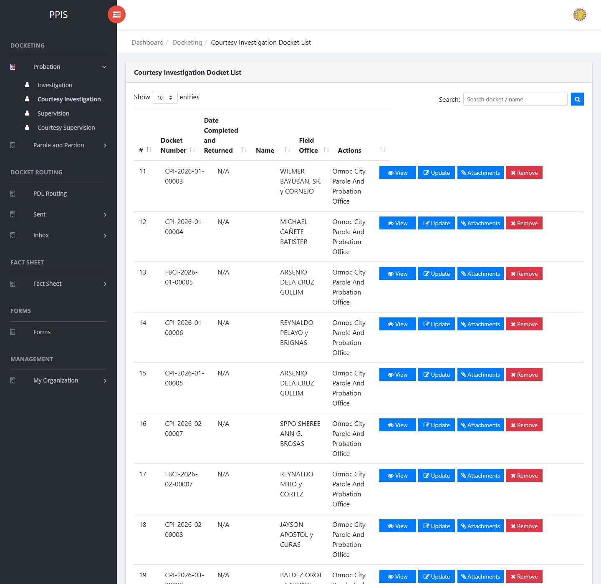

### 11. Courtesy Investigation Docket List - modal Remove

- Purpose: Shows the Remove modal/dialog state.
- Screenshot Filename: screenshots/011-courtesy-investigation-docket-list-modal-remove.png
- URL: http://localhost/pis/probation-courtesy-investigation-list
- Description of visible controls and functions:
  - Buttons/actions: Run search; View; Update; Attachments; Remove
  - Links/navigation: Investigation; Courtesy Investigation; Supervision; Courtesy Supervision; PDL Routing; Forms; Dashboard; Docketing
  - Input fields: Search docket / name
  - Dropdowns: tblCourtesyInvestigationDockets_length
  - Tables: #, Docket Number, Date Completed and Returned, Name, Field Office, Actions
  - Modals available: Permanently remove docket?
  - Pagination: Previous 1 2 3 Next

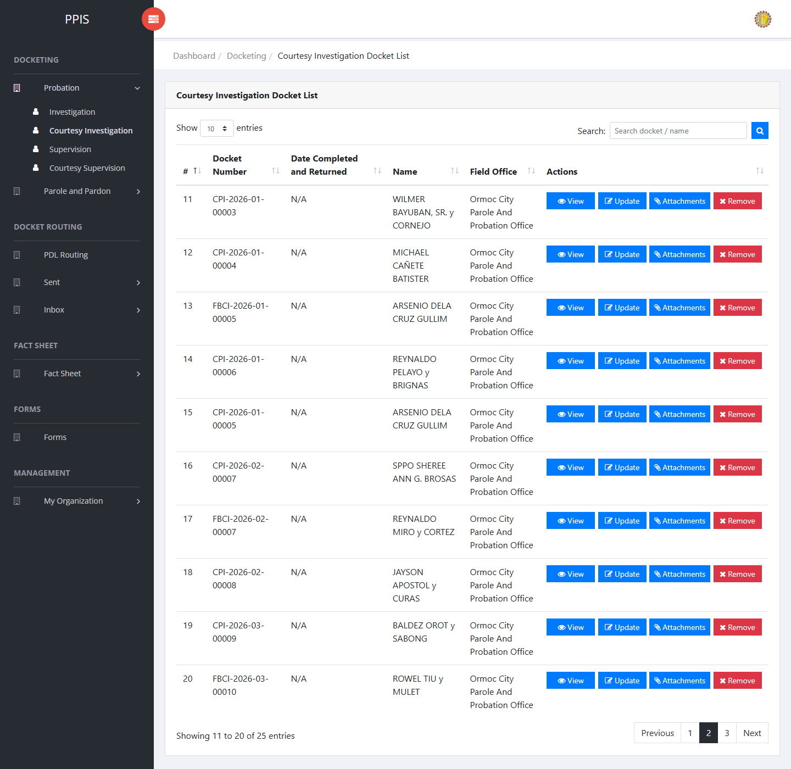

### 12. Supervision Docket List

- Purpose: Provides a landing view for system activity and logged-in user navigation.
- Screenshot Filename: screenshots/012-supervision-docket-list.png
- URL: http://localhost/pis/supervision_docketing
- Description of visible controls and functions:
  - Buttons/actions: Run search; View; Update; Attachments; Remove
  - Links/navigation: Investigation; Courtesy Investigation; Supervision; Courtesy Supervision; PDL Routing; Forms; Dashboard; Docket
  - Input fields: Search docket / name
  - Dropdowns: tblSupervisionDocketing_length
  - Tables: #, Docket Number, Received Date, Name, Criminal Case No., Field Office, Actions
  - Modals available: Permanently remove docket?
  - Pagination: Previous 1 2 3 4 5 … 30 Next

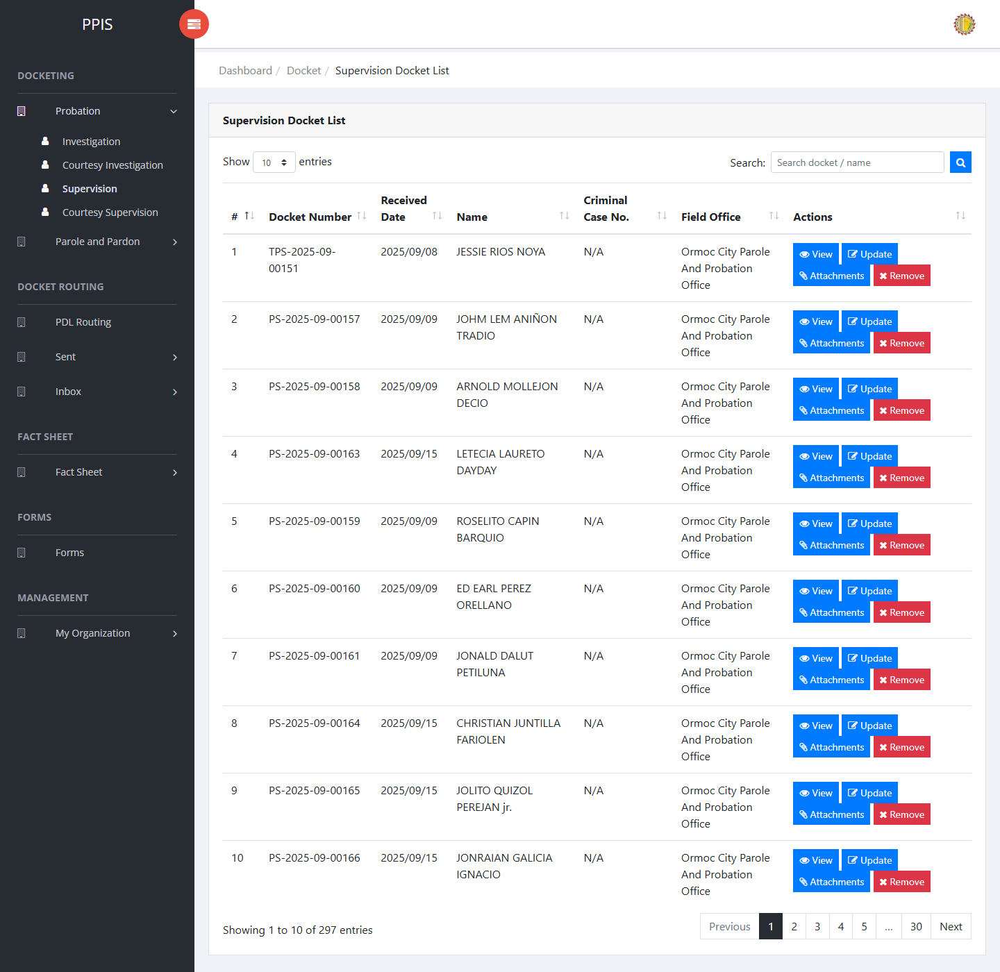

### 13. Supervision Docket List - pagination next page

- Purpose: Shows paginated data after moving to the next page.
- Screenshot Filename: screenshots/013-supervision-docket-list-pagination-next-page.png
- URL: http://localhost/pis/supervision_docketing
- Description of visible controls and functions:
  - Buttons/actions: Run search; View; Update; Attachments; Remove
  - Links/navigation: Investigation; Courtesy Investigation; Supervision; Courtesy Supervision; PDL Routing; Forms; Dashboard; Docket
  - Input fields: Search docket / name
  - Dropdowns: tblSupervisionDocketing_length
  - Tables: #, Docket Number, Received Date, Name, Criminal Case No., Field Office, Actions
  - Modals available: Permanently remove docket?
  - Pagination: Previous 1 2 3 4 5 … 30 Next

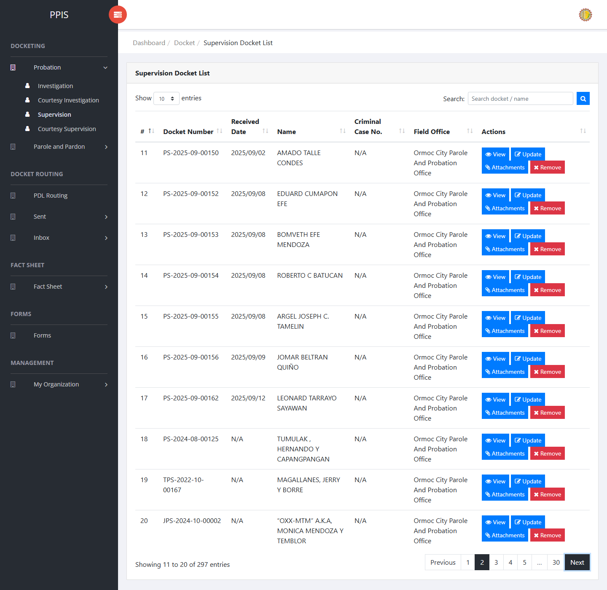

### 14. Supervision Docket List - modal Remove

- Purpose: Shows the Remove modal/dialog state.
- Screenshot Filename: screenshots/014-supervision-docket-list-modal-remove.png
- URL: http://localhost/pis/supervision_docketing
- Description of visible controls and functions:
  - Buttons/actions: Run search; View; Update; Attachments; Remove
  - Links/navigation: Investigation; Courtesy Investigation; Supervision; Courtesy Supervision; PDL Routing; Forms; Dashboard; Docket
  - Input fields: Search docket / name
  - Dropdowns: tblSupervisionDocketing_length
  - Tables: #, Docket Number, Received Date, Name, Criminal Case No., Field Office, Actions
  - Modals available: Permanently remove docket?
  - Pagination: Previous 1 2 3 4 5 … 30 Next

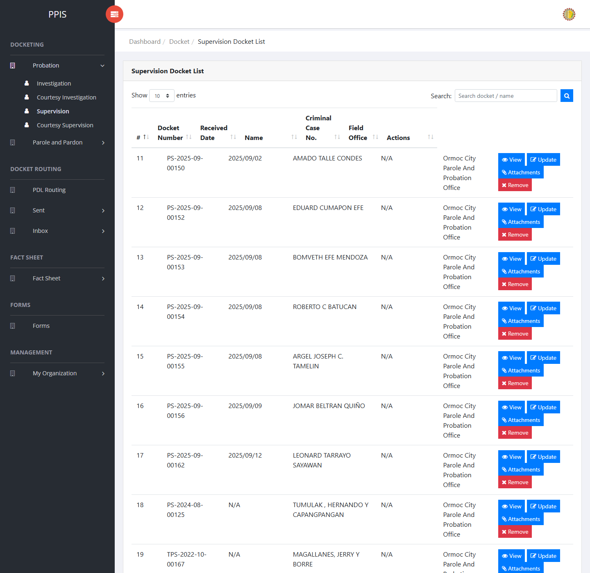

### 15. Supervision Docket List - modal Remove

- Purpose: Shows the Remove modal/dialog state.
- Screenshot Filename: screenshots/015-supervision-docket-list-modal-remove.png
- URL: http://localhost/pis/supervision_docketing
- Description of visible controls and functions:
  - Buttons/actions: Run search; View; Update; Attachments; Remove
  - Links/navigation: Investigation; Courtesy Investigation; Supervision; Courtesy Supervision; PDL Routing; Forms; Dashboard; Docket
  - Input fields: Search docket / name
  - Dropdowns: tblSupervisionDocketing_length
  - Tables: #, Docket Number, Received Date, Name, Criminal Case No., Field Office, Actions
  - Modals available: Permanently remove docket?
  - Pagination: Previous 1 2 3 4 5 … 30 Next

### 16. Courtesy Supervision Docket List

- Purpose: Provides a landing view for system activity and logged-in user navigation.
- Screenshot Filename: screenshots/016-courtesy-supervision-docket-list.png
- URL: http://localhost/pis/probation-courtesy-supervision-list
- Description of visible controls and functions:
  - Buttons/actions: Run search; View; Update; Attachments; Remove
  - Links/navigation: Investigation; Courtesy Investigation; Supervision; Courtesy Supervision; PDL Routing; Forms; Dashboard; Docket
  - Input fields: Search docket / name
  - Dropdowns: tblCourtesySupervisionDockets_length
  - Tables: #, Docket Number, Date Completed and Returned, Name, Criminal Case No., Actions
  - Modals available: Permanently remove docket?
  - Pagination: Previous 1 Next

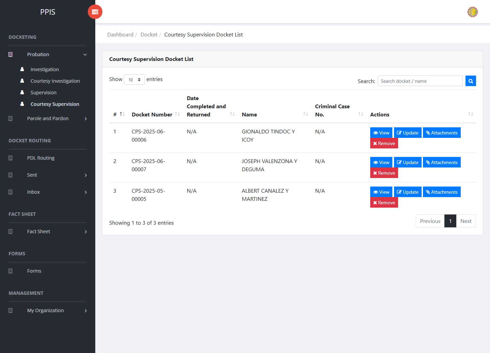

### 17. Courtesy Supervision Docket List - modal Remove

- Purpose: Shows the Remove modal/dialog state.
- Screenshot Filename: screenshots/017-courtesy-supervision-docket-list-modal-remove.png
- URL: http://localhost/pis/probation-courtesy-supervision-list
- Description of visible controls and functions:
  - Buttons/actions: Run search; View; Update; Attachments; Remove
  - Links/navigation: Investigation; Courtesy Investigation; Supervision; Courtesy Supervision; PDL Routing; Forms; Dashboard; Docket
  - Input fields: Search docket / name
  - Dropdowns: tblCourtesySupervisionDockets_length
  - Tables: #, Docket Number, Date Completed and Returned, Name, Criminal Case No., Actions
  - Modals available: Permanently remove docket?
  - Pagination: Previous 1 Next

### 18. Courtesy Supervision Docket List - modal Remove

- Purpose: Shows the Remove modal/dialog state.
- Screenshot Filename: screenshots/018-courtesy-supervision-docket-list-modal-remove.png
- URL: http://localhost/pis/probation-courtesy-supervision-list
- Description of visible controls and functions:
  - Buttons/actions: Run search; View; Update; Attachments; Remove
  - Links/navigation: Investigation; Courtesy Investigation; Supervision; Courtesy Supervision; PDL Routing; Forms; Dashboard; Docket
  - Input fields: Search docket / name
  - Dropdowns: tblCourtesySupervisionDockets_length
  - Tables: #, Docket Number, Date Completed and Returned, Name, Criminal Case No., Actions
  - Modals available: Permanently remove docket?
  - Pagination: Previous 1 Next

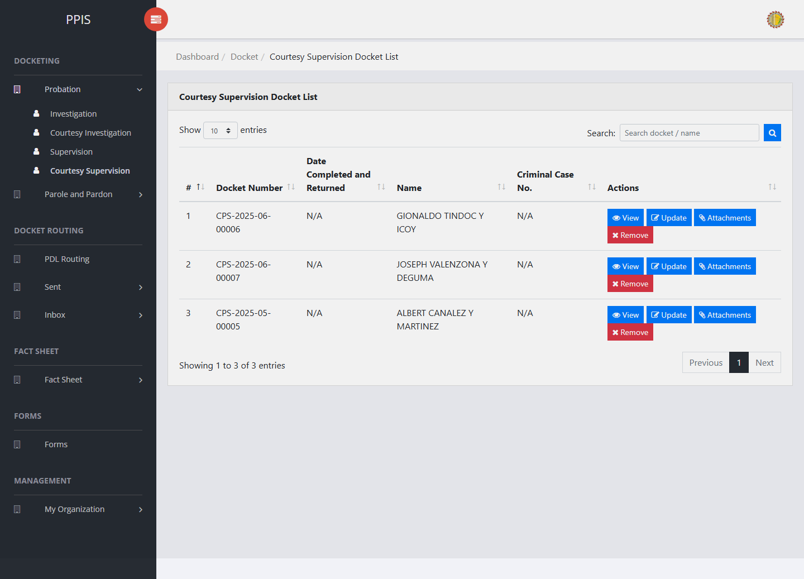

### 19. Parole and Pardon Investigation Docket List

- Purpose: Provides a landing view for system activity and logged-in user navigation.
- Screenshot Filename: screenshots/019-parole-and-pardon-investigation-docket-list.png
- URL: http://localhost/pis/parole-pardon-investigation-list
- Description of visible controls and functions:
  - Buttons/actions: Run search
  - Links/navigation: Investigation; Courtesy Investigation; Supervision; Courtesy Supervision; PDL Routing; Forms; Dashboard; Parole And Pardon
  - Input fields: Docket Number, CC Number, Name
  - Dropdowns: tblScPreParoleInv_length
  - Tables: #, Docket Number, Full Name, Actions
  - Modals available: Permanently remove docket?
  - Pagination: Previous Next

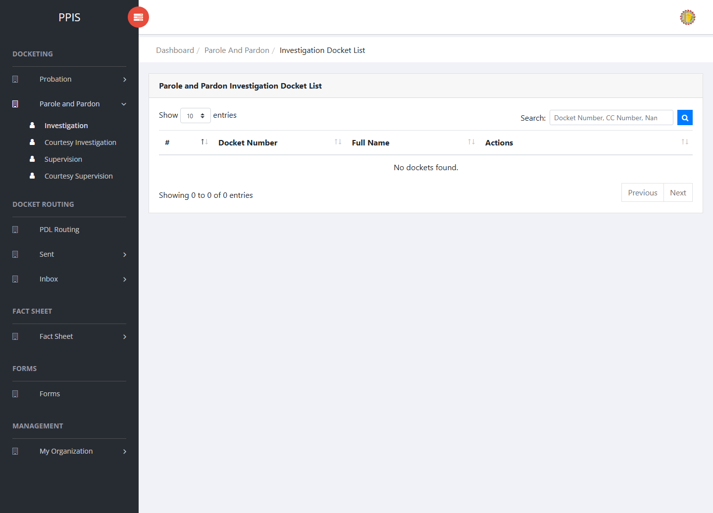

### 20. Parole and Pardon Courtesy Investigation Docket List

- Purpose: Provides a landing view for system activity and logged-in user navigation.
- Screenshot Filename: screenshots/020-parole-and-pardon-courtesy-investigation-docket-list.png
- URL: http://localhost/pis/parole-pardon-courtesy-investigation-list
- Description of visible controls and functions:
  - Buttons/actions: Run search; View; Update; Attachments; Remove
  - Links/navigation: Investigation; Courtesy Investigation; Supervision; Courtesy Supervision; PDL Routing; Forms; Dashboard; Pre-Parole
  - Input fields: Search docket / name
  - Dropdowns: tblScPreParoleCourtesyInv_length
  - Tables: #, Docket Number, Full Name, Referring Office, Actions
  - Modals available: Permanently remove docket?
  - Pagination: Previous 1 2 3 4 Next

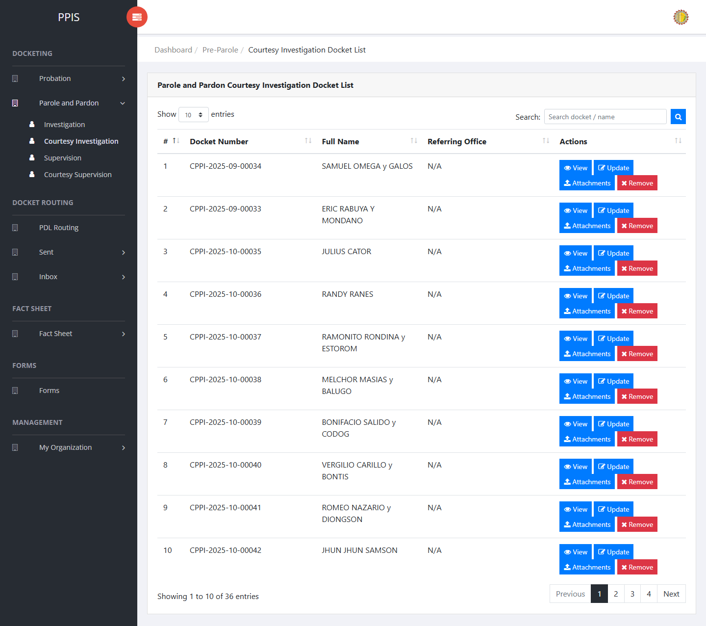

### 21. Parole and Pardon Courtesy Investigation Docket List - pagination next page

- Purpose: Shows paginated data after moving to the next page.
- Screenshot Filename: screenshots/021-parole-and-pardon-courtesy-investigation-docket-list-pagination-next-page.png
- URL: http://localhost/pis/parole-pardon-courtesy-investigation-list
- Description of visible controls and functions:
  - Buttons/actions: Run search; View; Update; Attachments; Remove
  - Links/navigation: Investigation; Courtesy Investigation; Supervision; Courtesy Supervision; PDL Routing; Forms; Dashboard; Pre-Parole
  - Input fields: Search docket / name
  - Dropdowns: tblScPreParoleCourtesyInv_length
  - Tables: #, Docket Number, Full Name, Referring Office, Actions
  - Modals available: Permanently remove docket?
  - Pagination: Previous 1 2 3 4 Next

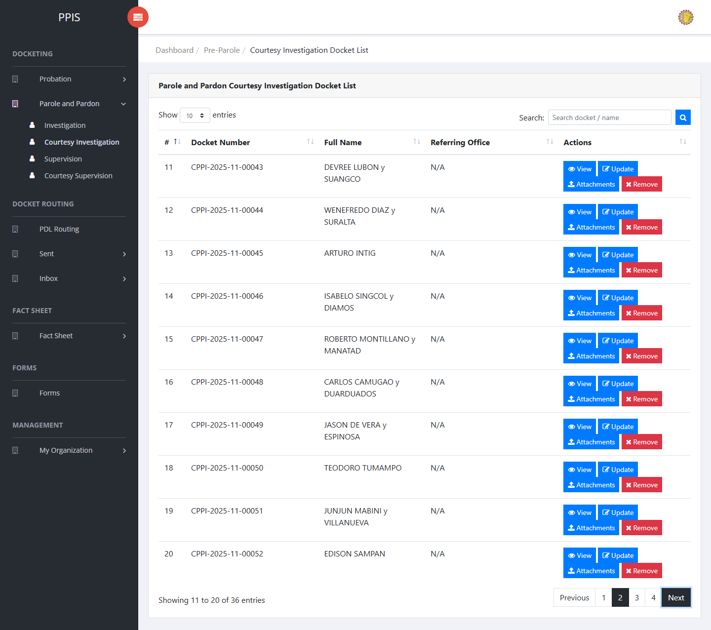

### 22. Parole and Pardon Courtesy Investigation Docket List - modal Remove

- Purpose: Shows the Remove modal/dialog state.
- Screenshot Filename: screenshots/022-parole-and-pardon-courtesy-investigation-docket-list-modal-remove.png
- URL: http://localhost/pis/parole-pardon-courtesy-investigation-list
- Description of visible controls and functions:
  - Buttons/actions: Run search; View; Update; Attachments; Remove
  - Links/navigation: Investigation; Courtesy Investigation; Supervision; Courtesy Supervision; PDL Routing; Forms; Dashboard; Pre-Parole
  - Input fields: Search docket / name
  - Dropdowns: tblScPreParoleCourtesyInv_length
  - Tables: #, Docket Number, Full Name, Referring Office, Actions
  - Modals available: Permanently remove docket?
  - Pagination: Previous 1 2 3 4 Next

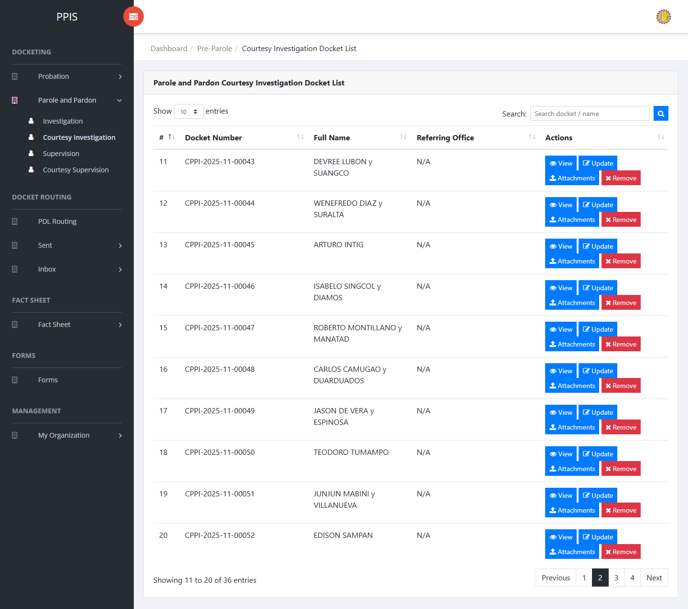

### 23. Parole and Pardon Courtesy Investigation Docket List - modal Remove

- Purpose: Shows the Remove modal/dialog state.
- Screenshot Filename: screenshots/023-parole-and-pardon-courtesy-investigation-docket-list-modal-remove.png
- URL: http://localhost/pis/parole-pardon-courtesy-investigation-list
- Description of visible controls and functions:
  - Buttons/actions: Run search; View; Update; Attachments; Remove
  - Links/navigation: Investigation; Courtesy Investigation; Supervision; Courtesy Supervision; PDL Routing; Forms; Dashboard; Pre-Parole
  - Input fields: Search docket / name
  - Dropdowns: tblScPreParoleCourtesyInv_length
  - Tables: #, Docket Number, Full Name, Referring Office, Actions
  - Modals available: Permanently remove docket?
  - Pagination: Previous 1 2 3 4 Next

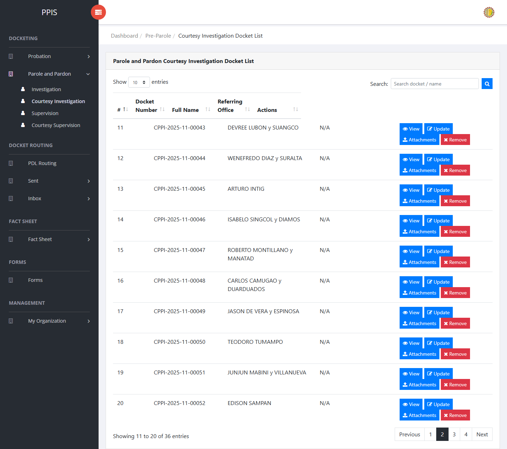

### 24. Supervision Docket List

- Purpose: Provides a landing view for system activity and logged-in user navigation.
- Screenshot Filename: screenshots/024-supervision-docket-list.png
- URL: http://localhost/pis/parole-pardon-supervision
- Description of visible controls and functions:
  - Buttons/actions: Run search; View; Update; Attachments; Remove
  - Links/navigation: Investigation; Courtesy Investigation; Supervision; Courtesy Supervision; PDL Routing; Forms; Dashboard; Parole And Pardon
  - Input fields: Search docket / name
  - Dropdowns: tblScPreParoleSupervision_length; sc_ppr_sup_client_type
  - Tables: #, Docket Number, Received Date, Name, Criminal Case No., Field Office, Actions
  - Modals available: Permanently remove docket?
  - Pagination: Previous 1 2 3 Next

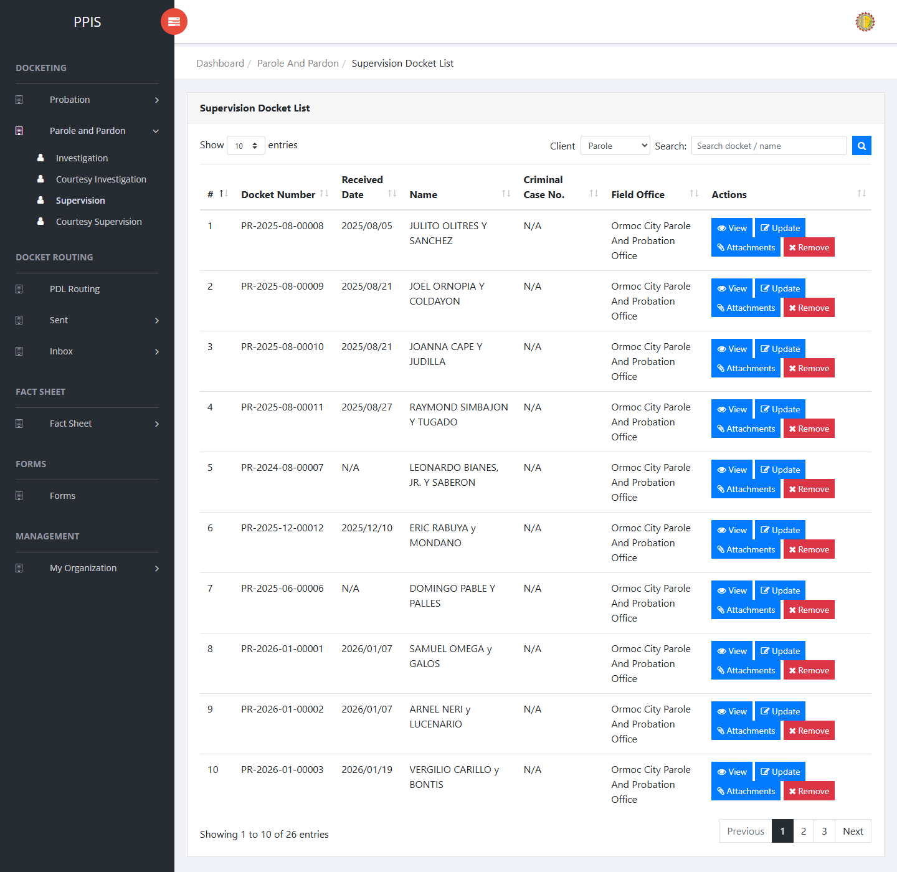

### 25. Supervision Docket List - pagination next page

- Purpose: Shows paginated data after moving to the next page.
- Screenshot Filename: screenshots/025-supervision-docket-list-pagination-next-page.png
- URL: http://localhost/pis/parole-pardon-supervision
- Description of visible controls and functions:
  - Buttons/actions: Run search; View; Update; Attachments; Remove
  - Links/navigation: Investigation; Courtesy Investigation; Supervision; Courtesy Supervision; PDL Routing; Forms; Dashboard; Parole And Pardon
  - Input fields: Search docket / name
  - Dropdowns: tblScPreParoleSupervision_length; sc_ppr_sup_client_type
  - Tables: #, Docket Number, Received Date, Name, Criminal Case No., Field Office, Actions
  - Modals available: Permanently remove docket?
  - Pagination: Previous 1 2 3 Next

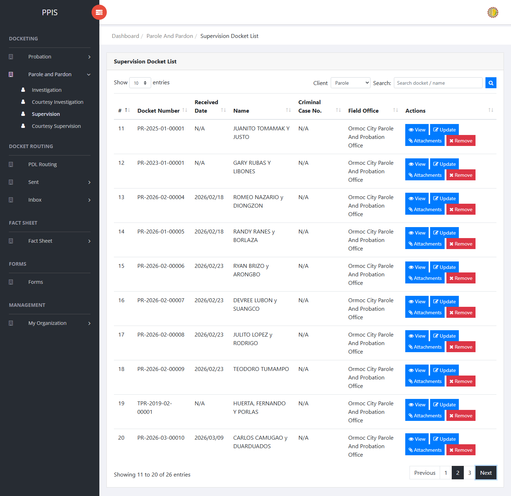

### 26. Supervision Docket List - modal Remove

- Purpose: Shows the Remove modal/dialog state.
- Screenshot Filename: screenshots/026-supervision-docket-list-modal-remove.png
- URL: http://localhost/pis/parole-pardon-supervision
- Description of visible controls and functions:
  - Buttons/actions: Run search; View; Update; Attachments; Remove
  - Links/navigation: Investigation; Courtesy Investigation; Supervision; Courtesy Supervision; PDL Routing; Forms; Dashboard; Parole And Pardon
  - Input fields: Search docket / name
  - Dropdowns: tblScPreParoleSupervision_length; sc_ppr_sup_client_type
  - Tables: #, Docket Number, Received Date, Name, Criminal Case No., Field Office, Actions
  - Modals available: Permanently remove docket?
  - Pagination: Previous 1 2 3 Next

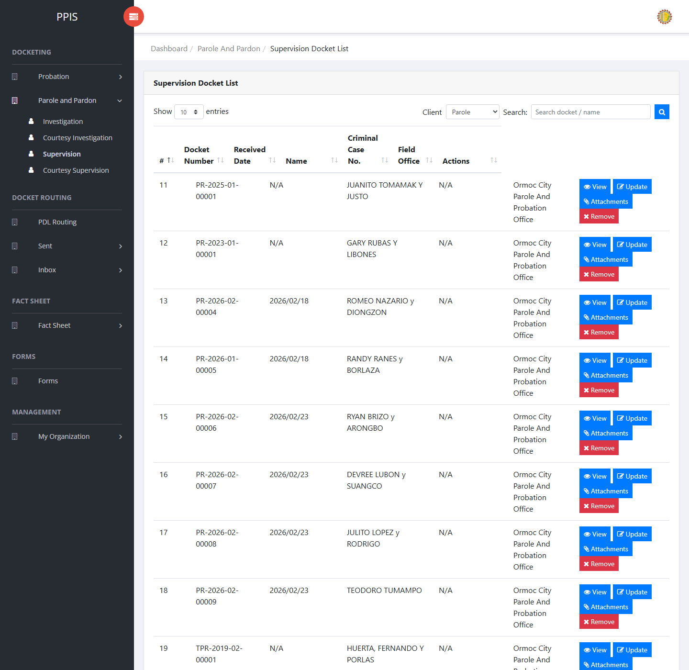

### 27. Supervision Docket List - modal Remove

- Purpose: Shows the Remove modal/dialog state.
- Screenshot Filename: screenshots/027-supervision-docket-list-modal-remove.png
- URL: http://localhost/pis/parole-pardon-supervision
- Description of visible controls and functions:
  - Buttons/actions: Run search; View; Update; Attachments; Remove
  - Links/navigation: Investigation; Courtesy Investigation; Supervision; Courtesy Supervision; PDL Routing; Forms; Dashboard; Parole And Pardon
  - Input fields: Search docket / name
  - Dropdowns: tblScPreParoleSupervision_length; sc_ppr_sup_client_type
  - Tables: #, Docket Number, Received Date, Name, Criminal Case No., Field Office, Actions
  - Modals available: Permanently remove docket?
  - Pagination: Previous 1 2 3 Next

### 28. Parole and Pardon Courtesy Supervision Docket List

- Purpose: Provides a landing view for system activity and logged-in user navigation.
- Screenshot Filename: screenshots/028-parole-and-pardon-courtesy-supervision-docket-list.png
- URL: http://localhost/pis/parole-pardon-courtesy-supervision-list
- Description of visible controls and functions:
  - Buttons/actions: Run search; View; Update; Attachments; Remove
  - Links/navigation: Investigation; Courtesy Investigation; Supervision; Courtesy Supervision; PDL Routing; Forms; Dashboard; Parole And Pardon
  - Input fields: Search docket / name
  - Dropdowns: tblScPreParoleCourtesySup_length; sc_ppcsup_client_type
  - Tables: #, Docket Number, Full Name, Referring Office, Actions
  - Modals available: Permanently remove docket?
  - Pagination: Previous 1 Next

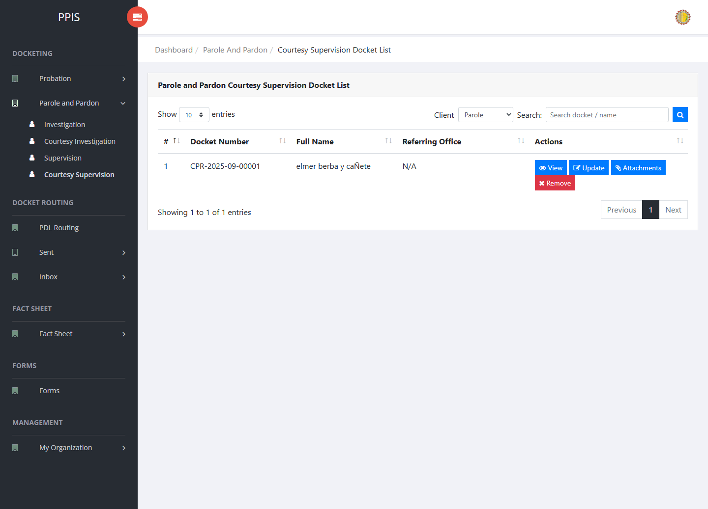

### 29. Parole and Pardon Courtesy Supervision Docket List - modal Remove

- Purpose: Shows the Remove modal/dialog state.
- Screenshot Filename: screenshots/029-parole-and-pardon-courtesy-supervision-docket-list-modal-remove.png
- URL: http://localhost/pis/parole-pardon-courtesy-supervision-list
- Description of visible controls and functions:
  - Buttons/actions: Run search; View; Update; Attachments; Remove
  - Links/navigation: Investigation; Courtesy Investigation; Supervision; Courtesy Supervision; PDL Routing; Forms; Dashboard; Parole And Pardon
  - Input fields: Search docket / name
  - Dropdowns: tblScPreParoleCourtesySup_length; sc_ppcsup_client_type
  - Tables: #, Docket Number, Full Name, Referring Office, Actions
  - Modals available: Permanently remove docket?
  - Pagination: Previous 1 Next

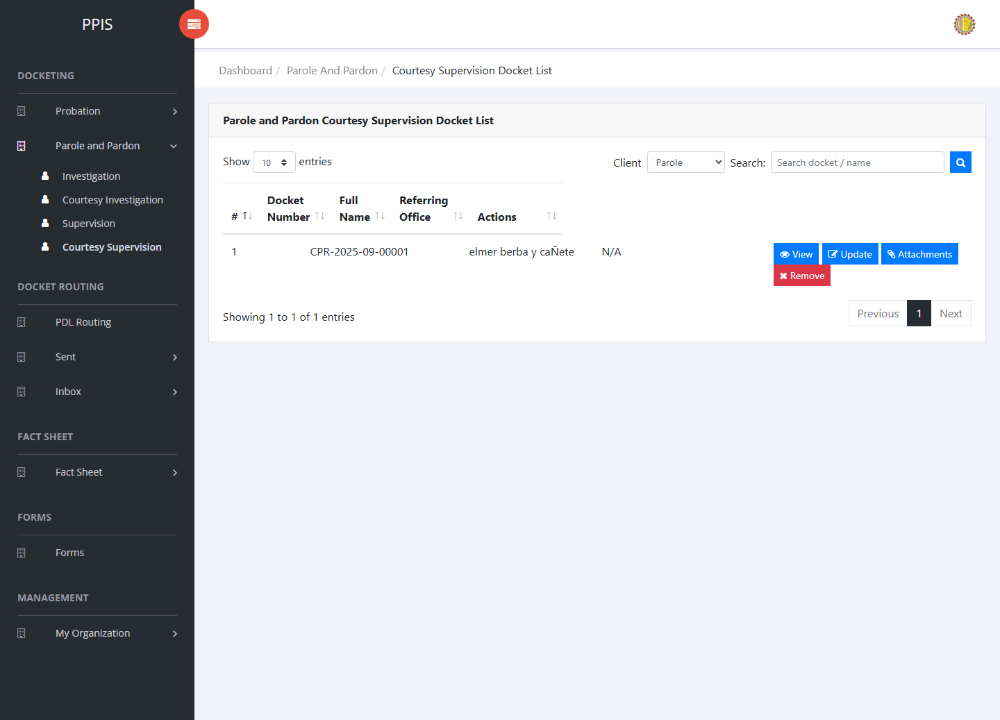

### 30. Forward PDL

- Purpose: Provides a landing view for system activity and logged-in user navigation.
- Screenshot Filename: screenshots/030-forward-pdl.png
- URL: http://localhost/pis/pdl-docket
- Description of visible controls and functions:
  - Buttons/actions: Confirm
  - Links/navigation: PDL Routing; Forms; Dashboard
  - Input fields: Enter Subject; Enter Details
  - Dropdowns: select

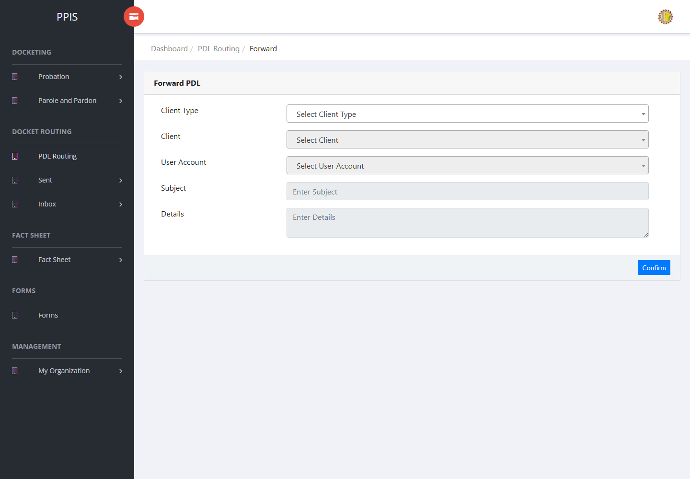

### 31. PDL Sent

- Purpose: Provides a landing view for system activity and logged-in user navigation.
- Screenshot Filename: screenshots/031-pdl-sent.png
- URL: http://localhost/pis/pdl-sent
- Description of visible controls and functions:
  - Links/navigation: PDL Routing; PDL; Forms; Dashboard
  - Input fields: search
  - Dropdowns: DataTables_Table_0_length
  - Tables: #, Transaction Number, Field Office, Sender, Subject, Actions
  - Modals available: Complete Docket
  - Filters/search: Search/filter field
  - Pagination: Previous Next

### 32. PDL Sent - filtered data

- Purpose: Shows the page with its search or filter control applied.
- Screenshot Filename: screenshots/032-pdl-sent-filtered-data.png
- URL: http://localhost/pis/pdl-sent
- Description of visible controls and functions:
  - Links/navigation: PDL Routing; PDL; Forms; Dashboard
  - Input fields: search
  - Dropdowns: DataTables_Table_0_length
  - Tables: #, Transaction Number, Field Office, Sender, Subject, Actions
  - Modals available: Complete Docket
  - Filters/search: Search/filter field
  - Pagination: Previous Next

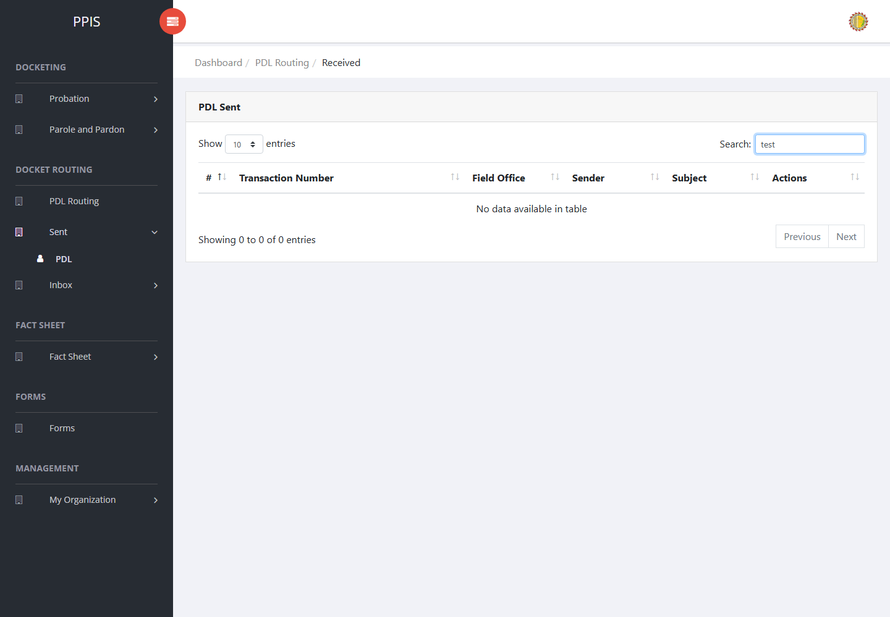

### 33. PDL Inbox

- Purpose: Provides a landing view for system activity and logged-in user navigation.
- Screenshot Filename: screenshots/033-pdl-inbox.png
- URL: http://localhost/pis/pdl-receive
- Description of visible controls and functions:
  - Links/navigation: PDL Routing; PDL; Forms; Dashboard
  - Dropdowns: DataTables_Table_0_length
  - Tables: #, Status, Field Office, Sender, Sender Field Office, Subject, Actions
  - Tabs: Investigation; Supervision
  - Modals available: Complete Docket
  - Pagination: Previous Next

### 34. PDL Inbox - tab Investigation

- Purpose: Shows the Investigation tab state and its available controls.
- Screenshot Filename: screenshots/034-pdl-inbox-tab-investigation.png
- URL: http://localhost/pis/pdl-receive
- Description of visible controls and functions:
  - Links/navigation: PDL Routing; PDL; Forms; Dashboard
  - Dropdowns: DataTables_Table_0_length
  - Tables: #, Status, Field Office, Sender, Sender Field Office, Subject, Actions
  - Tabs: Investigation; Supervision
  - Modals available: Complete Docket
  - Pagination: Previous Next

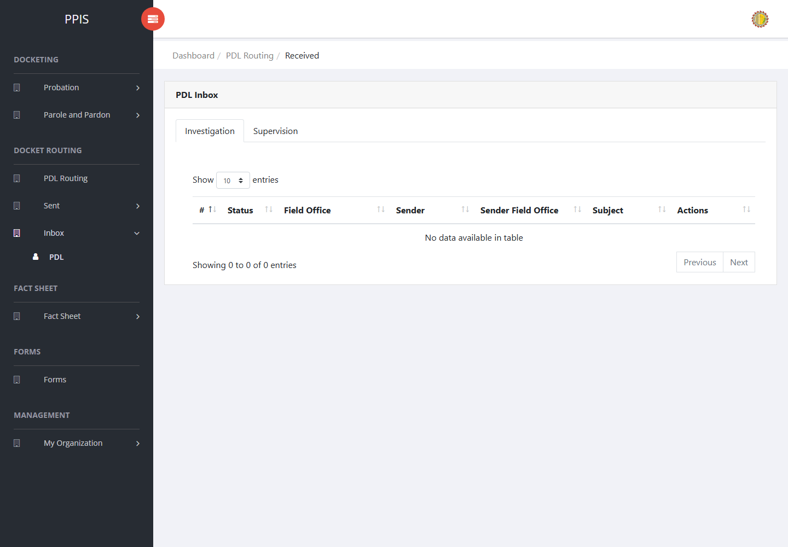

### 35. PDL Inbox - tab Supervision

- Purpose: Shows the Supervision tab state and its available controls.
- Screenshot Filename: screenshots/035-pdl-inbox-tab-supervision.png
- URL: http://localhost/pis/pdl-receive
- Description of visible controls and functions:
  - Links/navigation: PDL Routing; PDL; Forms; Dashboard
  - Dropdowns: DataTables_Table_0_length
  - Tables: #, Status, Field Office, Sender, Sender Field Office, Subject, Actions
  - Tabs: Investigation; Supervision
  - Modals available: Complete Docket
  - Pagination: Previous Next

### 36. Probation Fact Sheet

- Purpose: Provides a landing view for system activity and logged-in user navigation.
- Screenshot Filename: screenshots/036-probation-fact-sheet.png
- URL: http://localhost/pis/client_list
- Description of visible controls and functions:
  - Buttons/actions: Run search
  - Links/navigation: PDL Routing; Probation; Parole and Pardone; PDL; Forms; Dashboard; Fact Sheet; RAUL FERNANDEZ y MAÑANITA; LEVY YURAG Y LUBANG; JOSEPH CACANOG Y TEGI; ANNABELLE OBIEN Y TAVERA; MA. LORNA A. BALLERA
  - Input fields: Name or case number
  - Dropdowns: tblProbationClientList_length
  - Tables: #, Full Name, Criminal Case Number, Field Office, Worksheet Status
  - Filters/search: Name or case number
  - Pagination: Previous 1 2 3 4 5 … 72 Next

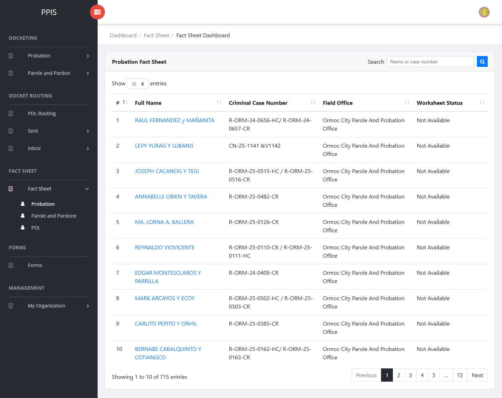

### 37. Probation Fact Sheet - filtered data

- Purpose: Shows the page with its search or filter control applied.
- Screenshot Filename: screenshots/037-probation-fact-sheet-filtered-data.png
- URL: http://localhost/pis/client_list
- Description of visible controls and functions:
  - Buttons/actions: Clear search; Run search
  - Links/navigation: PDL Routing; Probation; Parole and Pardone; PDL; Forms; Dashboard; Fact Sheet; RAUL FERNANDEZ y MAÑANITA; LEVY YURAG Y LUBANG; JOSEPH CACANOG Y TEGI; ANNABELLE OBIEN Y TAVERA; MA. LORNA A. BALLERA
  - Input fields: Name or case number
  - Dropdowns: tblProbationClientList_length
  - Tables: #, Full Name, Criminal Case Number, Field Office, Worksheet Status
  - Filters/search: Name or case number
  - Pagination: Previous 1 2 3 4 5 … 72 Next

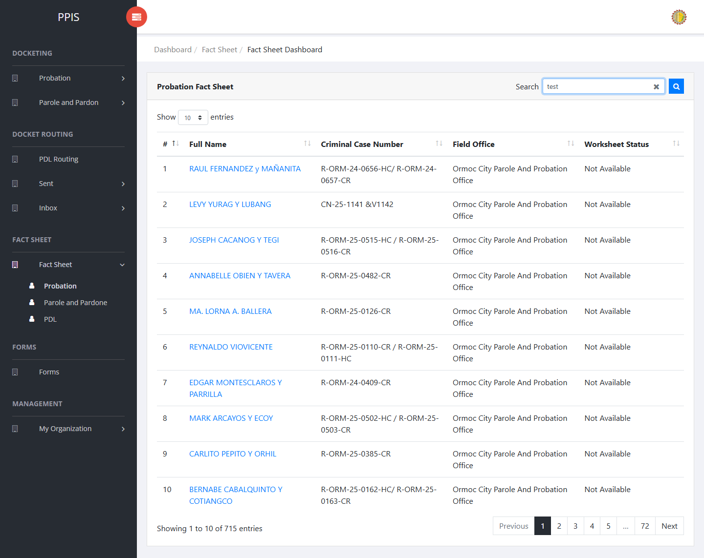

### 38. Probation Fact Sheet - pagination next page

- Purpose: Shows paginated data after moving to the next page.
- Screenshot Filename: screenshots/038-probation-fact-sheet-pagination-next-page.png
- URL: http://localhost/pis/client_list
- Description of visible controls and functions:
  - Buttons/actions: Run search
  - Links/navigation: PDL Routing; Probation; Parole and Pardone; PDL; Forms; Dashboard; Fact Sheet; NONITO DRILON Y CATINGUB, JR.; RODEL PEPITO Y ARNEJO; EMILIANO POLE, JR. Y NAPOLES; JAY ENERO Y CUIZON; CLIFFORD GALO Y TABON
  - Input fields: Name or case number
  - Dropdowns: tblProbationClientList_length
  - Tables: #, Full Name, Criminal Case Number, Field Office, Worksheet Status
  - Filters/search: Name or case number
  - Pagination: Previous 1 2 3 4 5 … 72 Next

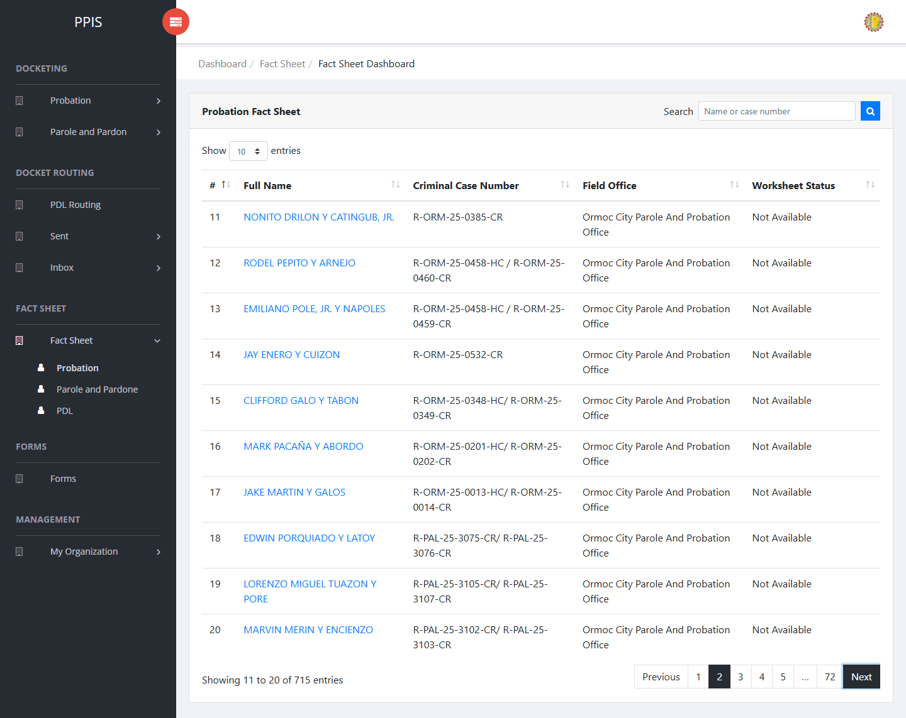

### 39. Docketing

- Purpose: Provides a landing view for system activity and logged-in user navigation.
- Screenshot Filename: screenshots/039-docketing.png
- URL: http://localhost/pis/client_list_parole_and_pardone
- Description of visible controls and functions:
  - Buttons/actions: Update; Attachments
  - Links/navigation: PDL Routing; Probation; Parole and Pardone; PDL; Forms; Dashboard; Fact Sheet
  - Input fields: Search Client
  - Dropdowns: DataTables_Table_0_length
  - Tables: #, Full Name, Criminal Case Number, Field Office, Actions
  - Tabs: Parole; Pardone
  - Modals available: Remove Docket
  - Pagination: Previous 1 2 3 4 5 Next

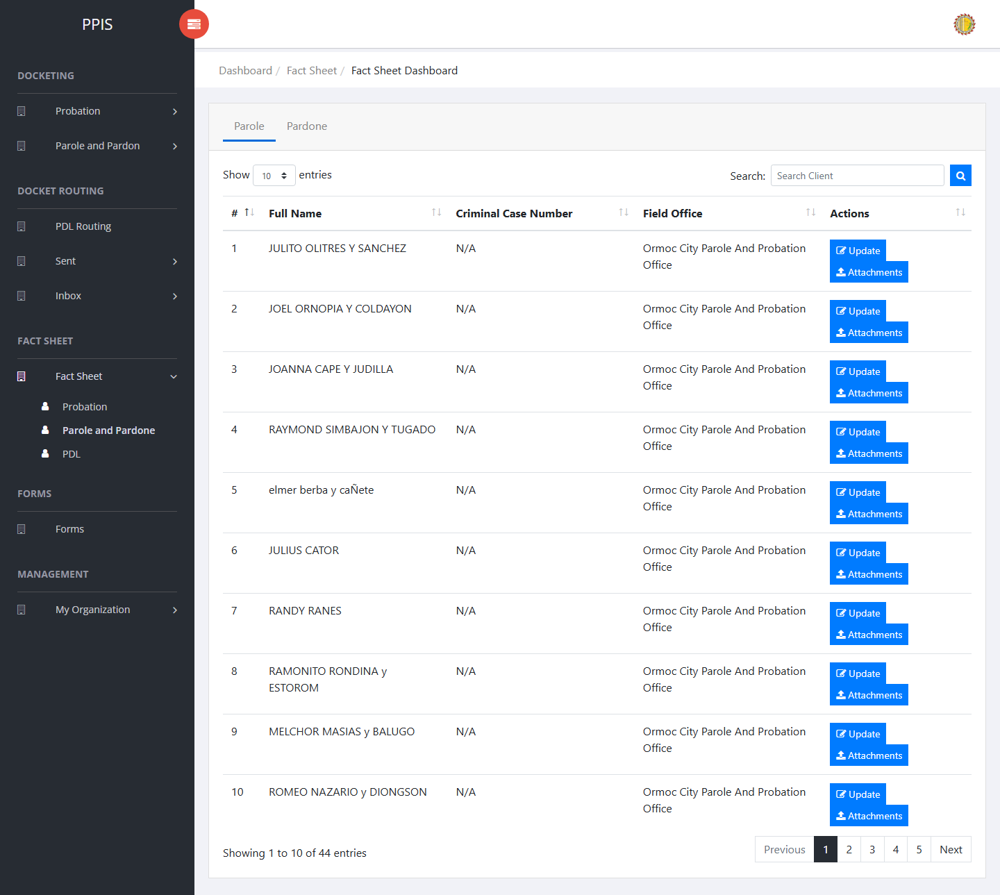

### 40. Docketing - tab Parole

- Purpose: Shows the Parole tab state and its available controls.
- Screenshot Filename: screenshots/040-docketing-tab-parole.png
- URL: http://localhost/pis/client_list_parole_and_pardone
- Description of visible controls and functions:
  - Buttons/actions: Update; Attachments
  - Links/navigation: PDL Routing; Probation; Parole and Pardone; PDL; Forms; Dashboard; Fact Sheet
  - Input fields: Search Client
  - Dropdowns: DataTables_Table_0_length
  - Tables: #, Full Name, Criminal Case Number, Field Office, Actions
  - Tabs: Parole; Pardone
  - Modals available: Remove Docket
  - Pagination: Previous 1 2 3 4 5 Next

### 41. Docketing - tab Pardone

- Purpose: Shows the Pardone tab state and its available controls.
- Screenshot Filename: screenshots/041-docketing-tab-pardone.png
- URL: http://localhost/pis/client_list_parole_and_pardone
- Description of visible controls and functions:
  - Links/navigation: PDL Routing; Probation; Parole and Pardone; PDL; Forms; Dashboard; Fact Sheet
  - Input fields: Search Client
  - Dropdowns: DataTables_Table_0_length
  - Tables: #, Full Name, Criminal Case Number, Field Office, Actions
  - Tabs: Parole; Pardone
  - Modals available: Remove Docket
  - Pagination: Previous Next

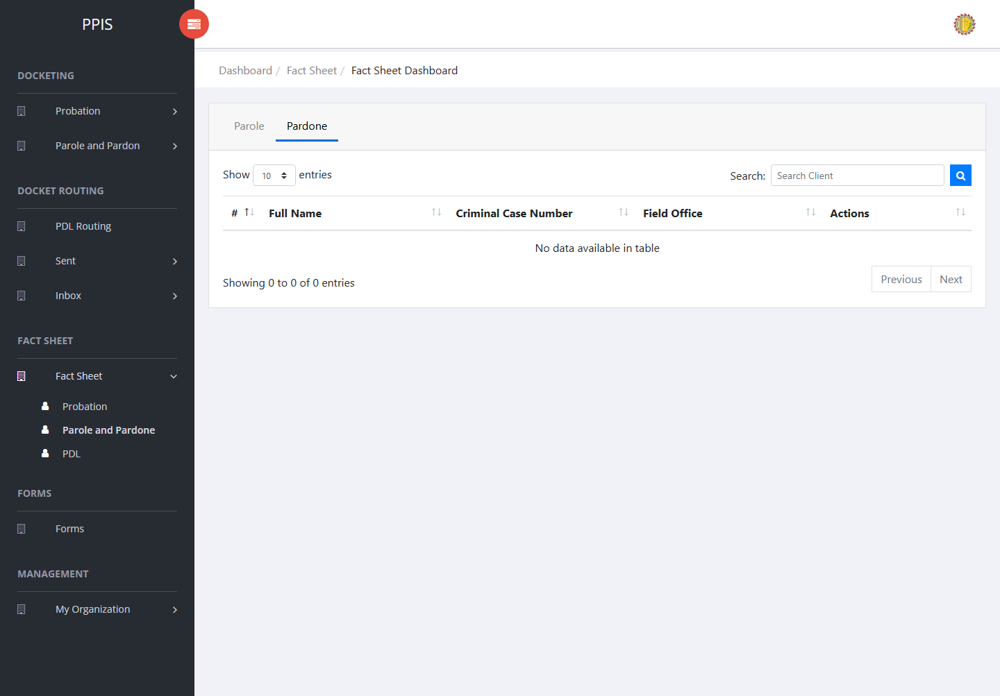

### 42. Docketing

- Purpose: Provides a landing view for system activity and logged-in user navigation.
- Screenshot Filename: screenshots/042-docketing.png
- URL: http://localhost/pis/client_list_single_carpeta
- Description of visible controls and functions:
  - Buttons/actions: Add Client
  - Links/navigation: PDL Routing; Probation; Parole and Pardone; PDL; Forms; Dashboard; Fact Sheet; Person Deprived Liberty
  - Input fields: Search Client
  - Dropdowns: tblPdlClientList_length
  - Tables: #, First Name, Middle Name, Last Name, Criminal Case Number, Prison Number, Actions
  - Modals available: Remove PDL Client
  - Pagination: Previous Next

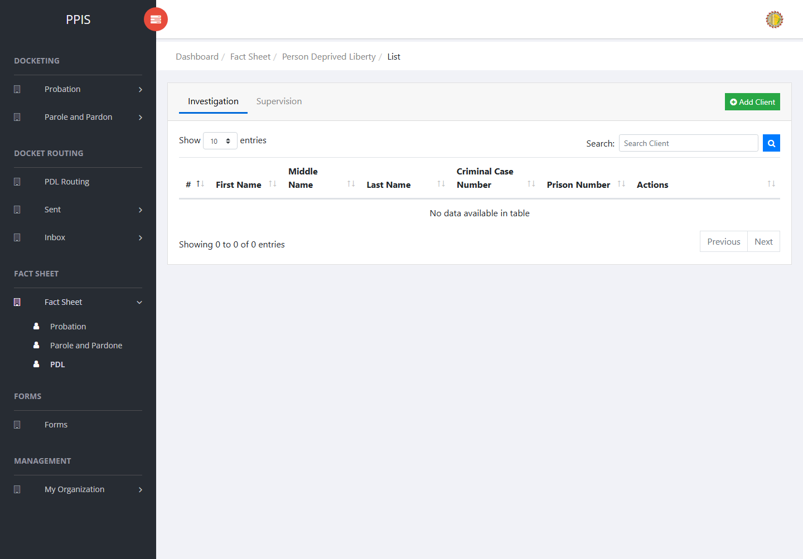

### 43. Forms List

- Purpose: Provides a landing view for system activity and logged-in user navigation.
- Screenshot Filename: screenshots/043-forms-list.png
- URL: http://localhost/pis/form_list
- Description of visible controls and functions:
  - Links/navigation: PDL Routing; Forms; Dashboard
  - Input fields: search
  - Dropdowns: DataTables_Table_0_length
  - Tables: #, File Name, Actions
  - Modals available: Remove Docket
  - Filters/search: Search/filter field
  - Pagination: Previous Next

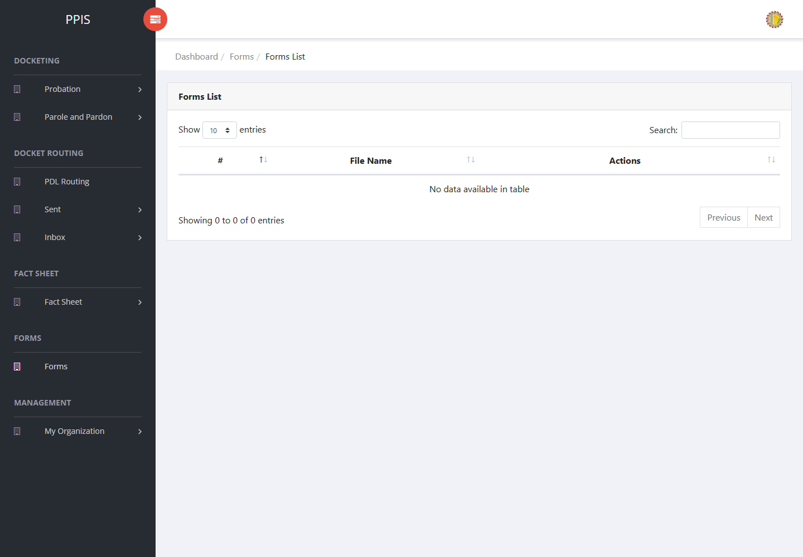

### 44. Forms List - filtered data

- Purpose: Shows the page with its search or filter control applied.
- Screenshot Filename: screenshots/044-forms-list-filtered-data.png
- URL: http://localhost/pis/form_list
- Description of visible controls and functions:
  - Links/navigation: PDL Routing; Forms; Dashboard
  - Input fields: search
  - Dropdowns: DataTables_Table_0_length
  - Tables: #, File Name, Actions
  - Modals available: Remove Docket
  - Filters/search: Search/filter field
  - Pagination: Previous Next

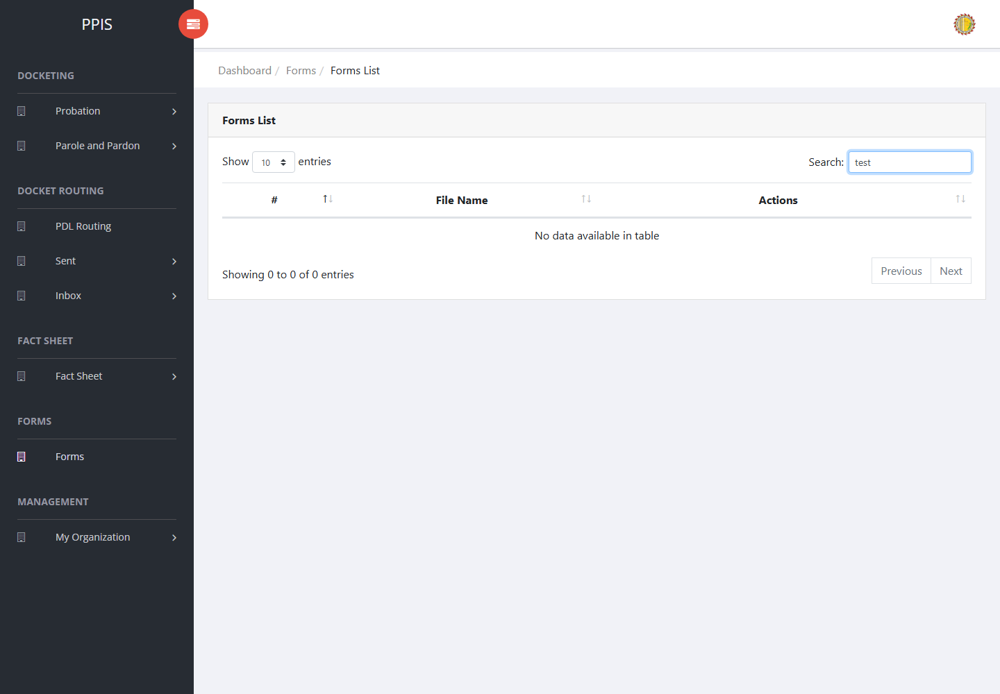

### 45. User Account List

- Purpose: Provides a landing view for system activity and logged-in user navigation.
- Screenshot Filename: screenshots/045-user-account-list.png
- URL: http://localhost/pis/user_accounts
- Description of visible controls and functions:
  - Buttons/actions: Add User Account; Search; Update; Deactivate; Remove; Restrict; Activate
  - Links/navigation: PDL Routing; Forms; User Accounts; User Roles; Field Office; Region; Permission; Dashboard; My Organization
  - Input fields: Enter Username
  - Dropdowns: DataTables_Table_0_length
  - Tables: Id, Full Name, Username, Email Address, User Role, Field Office, Status, Actions
  - Modals available: Update User Accounts; New User Account; Activate User Account; Deactivate User Account; Remove User Account; Restrict User Account; Lift User Account
  - Pagination: Previous 1 2 3 4 5 … 162 Next

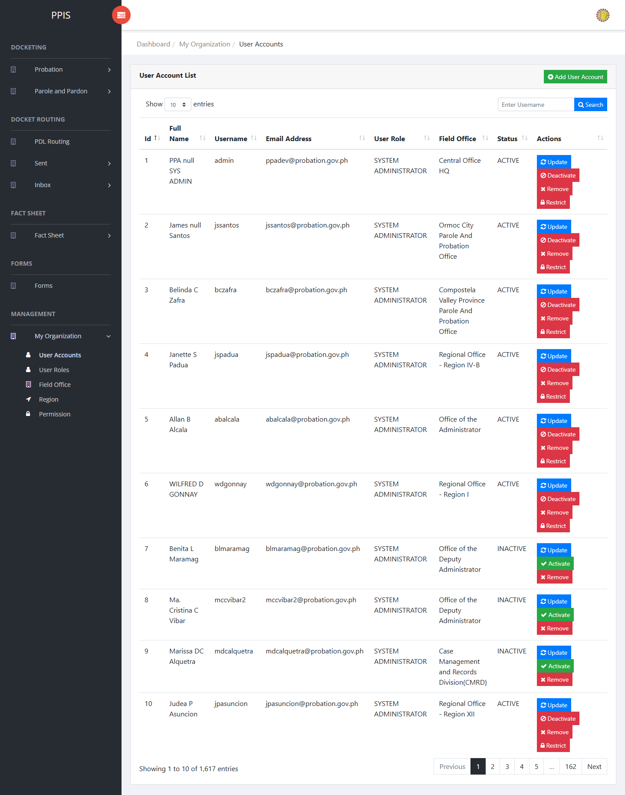

### 46. User Account List - pagination next page

- Purpose: Shows paginated data after moving to the next page.
- Screenshot Filename: screenshots/046-user-account-list-pagination-next-page.png
- URL: http://localhost/pis/user_accounts
- Description of visible controls and functions:
  - Buttons/actions: Add User Account; Search
  - Links/navigation: PDL Routing; Forms; User Accounts; User Roles; Field Office; Region; Permission; Dashboard; My Organization
  - Input fields: Enter Username
  - Dropdowns: DataTables_Table_0_length
  - Tables: Id, Full Name, Username, Email Address, User Role, Field Office, Status, Actions
  - Modals available: Update User Accounts; New User Account; Activate User Account; Deactivate User Account; Remove User Account; Restrict User Account; Lift User Account
  - Pagination: Previous Next

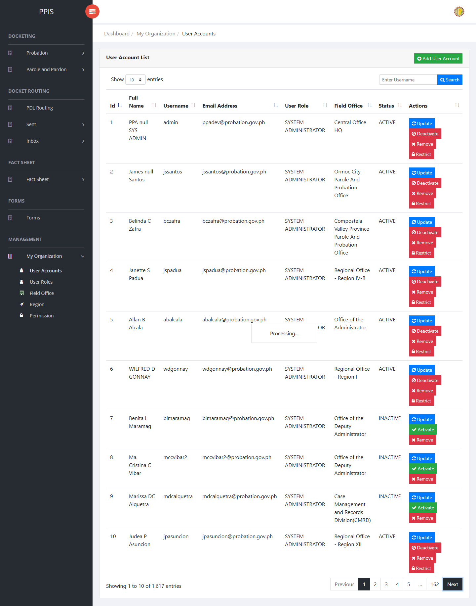

### 47. User Roles List

- Purpose: Provides a landing view for system activity and logged-in user navigation.
- Screenshot Filename: screenshots/047-user-roles-list.png
- URL: http://localhost/pis/user_roles
- Description of visible controls and functions:
  - Buttons/actions: Add Role; Update; Grant Permission; Update Permission
  - Links/navigation: PDL Routing; Forms; User Accounts; User Roles; Field Office; Region; Permission; Dashboard; My Organization
  - Input fields: Search
  - Tables: Id, Name, Description, Actions, Permission
  - Modals available: Update User Accounts; New User Role; Grant Permission; Update Permission
  - Filters/search: Search
  - Pagination: Previous 1 2 3 4 5 … 8 Next

### 48. User Roles List - filtered data

- Purpose: Shows the page with its search or filter control applied.
- Screenshot Filename: screenshots/048-user-roles-list-filtered-data.png
- URL: http://localhost/pis/user_roles
- Description of visible controls and functions:
  - Buttons/actions: Add Role; Update; Grant Permission; Update Permission
  - Links/navigation: PDL Routing; Forms; User Accounts; User Roles; Field Office; Region; Permission; Dashboard; My Organization
  - Input fields: Search
  - Tables: Id, Name, Description, Actions, Permission
  - Modals available: Update User Accounts; New User Role; Grant Permission; Update Permission
  - Filters/search: Search
  - Pagination: Previous 1 2 3 4 5 … 8 Next

### 49. User Roles List - pagination next page

- Purpose: Shows paginated data after moving to the next page.
- Screenshot Filename: screenshots/049-user-roles-list-pagination-next-page.png
- URL: http://localhost/pis/user_roles
- Description of visible controls and functions:
  - Buttons/actions: Add Role; Update; Grant Permission; Update Permission
  - Links/navigation: PDL Routing; Forms; User Accounts; User Roles; Field Office; Region; Permission; Dashboard; My Organization
  - Input fields: Search
  - Tables: Id, Name, Description, Actions, Permission
  - Modals available: Update User Accounts; New User Role; Grant Permission; Update Permission
  - Filters/search: Search
  - Pagination: Previous 1 2 3 4 5 … 8 Next

### 50. User Roles List - modal Add Role

- Purpose: Shows the Add Role modal/dialog state.
- Screenshot Filename: screenshots/050-user-roles-list-modal-add-role.png
- URL: http://localhost/pis/user_roles
- Description of visible controls and functions:
  - Buttons/actions: Add Role; Update; Grant Permission; Update Permission
  - Links/navigation: PDL Routing; Forms; User Accounts; User Roles; Field Office; Region; Permission; Dashboard; My Organization
  - Input fields: Search
  - Tables: Id, Name, Description, Actions, Permission
  - Modals available: Update User Accounts; New User Role; Grant Permission; Update Permission
  - Filters/search: Search
  - Pagination: Previous 1 2 3 4 5 … 8 Next

### 51. User Roles List - modal Update

- Purpose: Shows the Update modal/dialog state.
- Screenshot Filename: screenshots/051-user-roles-list-modal-update.png
- URL: http://localhost/pis/user_roles
- Description of visible controls and functions:
  - Buttons/actions: Add Role; Update; Grant Permission; Update Permission
  - Links/navigation: PDL Routing; Forms; User Accounts; User Roles; Field Office; Region; Permission; Dashboard; My Organization
  - Input fields: Search
  - Tables: Id, Name, Description, Actions, Permission
  - Modals available: Update User Accounts; New User Role; Grant Permission; Update Permission
  - Filters/search: Search
  - Pagination: Previous 1 2 3 4 5 … 8 Next

### 52. Field Office List

- Purpose: Provides a landing view for system activity and logged-in user navigation.
- Screenshot Filename: screenshots/052-field-office-list.png
- URL: http://localhost/pis/department
- Description of visible controls and functions:
  - Buttons/actions: Add Field Office; Update; Add; View; Remove
  - Links/navigation: PDL Routing; Forms; User Accounts; User Roles; Field Office; Region; Permission; Dashboard; My Organization
  - Input fields: Search
  - Tables: ID, Field Office Name, Description, Region, Action
  - Modals available: Update Field Office; Remove Field Office; New Field Office; Add Department; View details
  - Filters/search: Search
  - Pagination: Previous 1 2 3 4 5 … 24 Next

### 53. Field Office List - filtered data

- Purpose: Shows the page with its search or filter control applied.
- Screenshot Filename: screenshots/053-field-office-list-filtered-data.png
- URL: http://localhost/pis/department
- Description of visible controls and functions:
  - Buttons/actions: Add Field Office; Update; Add; View; Remove
  - Links/navigation: PDL Routing; Forms; User Accounts; User Roles; Field Office; Region; Permission; Dashboard; My Organization
  - Input fields: Search
  - Tables: ID, Field Office Name, Description, Region, Action
  - Modals available: Update Field Office; Remove Field Office; New Field Office; Add Department; View details
  - Filters/search: Search
  - Pagination: Previous 1 2 3 4 5 … 24 Next

### 54. Field Office List - pagination next page

- Purpose: Shows paginated data after moving to the next page.
- Screenshot Filename: screenshots/054-field-office-list-pagination-next-page.png
- URL: http://localhost/pis/department
- Description of visible controls and functions:
  - Buttons/actions: Add Field Office; Update; Add; View; Remove
  - Links/navigation: PDL Routing; Forms; User Accounts; User Roles; Field Office; Region; Permission; Dashboard; My Organization
  - Input fields: Search
  - Tables: ID, Field Office Name, Description, Region, Action
  - Modals available: Update Field Office; Remove Field Office; New Field Office; Add Department; View details
  - Filters/search: Search
  - Pagination: Previous 1 2 3 4 5 … 24 Next

### 55. Field Office List - modal Add Field Office

- Purpose: Shows the Add Field Office modal/dialog state.
- Screenshot Filename: screenshots/055-field-office-list-modal-add-field-office.png
- URL: http://localhost/pis/department
- Description of visible controls and functions:
  - Buttons/actions: Add Field Office; Update; Add; View; Remove
  - Links/navigation: PDL Routing; Forms; User Accounts; User Roles; Field Office; Region; Permission; Dashboard; My Organization
  - Input fields: Search
  - Tables: ID, Field Office Name, Description, Region, Action
  - Modals available: Update Field Office; Remove Field Office; New Field Office; Add Department; View details
  - Filters/search: Search
  - Pagination: Previous 1 2 3 4 5 … 24 Next

### 56. Field Office List - modal Update

- Purpose: Shows the Update modal/dialog state.
- Screenshot Filename: screenshots/056-field-office-list-modal-update.png
- URL: http://localhost/pis/department
- Description of visible controls and functions:
  - Buttons/actions: Add Field Office; Update; Add; View; Remove
  - Links/navigation: PDL Routing; Forms; User Accounts; User Roles; Field Office; Region; Permission; Dashboard; My Organization
  - Input fields: Search
  - Tables: ID, Field Office Name, Description, Region, Action
  - Modals available: Update Field Office; Remove Field Office; New Field Office; Add Department; View details
  - Filters/search: Search
  - Pagination: Previous 1 2 3 4 5 … 24 Next

### 57. Region List

- Purpose: Provides a landing view for system activity and logged-in user navigation.
- Screenshot Filename: screenshots/057-region-list.png
- URL: http://localhost/pis/location
- Description of visible controls and functions:
  - Buttons/actions: Add Region; Update; Remove
  - Links/navigation: PDL Routing; Forms; User Accounts; User Roles; Field Office; Region; Permission; Dashboard; My Organization
  - Input fields: Search
  - Tables: ID, Region, Address, Action
  - Modals available: Update Region; Remove Field Office; New Region; Deactivate User Account; Accept User Account
  - Filters/search: Search
  - Pagination: Previous 1 2 Next

### 58. Region List - filtered data

- Purpose: Shows the page with its search or filter control applied.
- Screenshot Filename: screenshots/058-region-list-filtered-data.png
- URL: http://localhost/pis/location
- Description of visible controls and functions:
  - Buttons/actions: Add Region; Update; Remove
  - Links/navigation: PDL Routing; Forms; User Accounts; User Roles; Field Office; Region; Permission; Dashboard; My Organization
  - Input fields: Search
  - Tables: ID, Region, Address, Action
  - Modals available: Update Region; Remove Field Office; New Region; Deactivate User Account; Accept User Account
  - Filters/search: Search
  - Pagination: Previous 1 2 Next

### 59. Region List - pagination next page

- Purpose: Shows paginated data after moving to the next page.
- Screenshot Filename: screenshots/059-region-list-pagination-next-page.png
- URL: http://localhost/pis/location
- Description of visible controls and functions:
  - Buttons/actions: Add Region; Update; Remove
  - Links/navigation: PDL Routing; Forms; User Accounts; User Roles; Field Office; Region; Permission; Dashboard; My Organization
  - Input fields: Search
  - Tables: ID, Region, Address, Action
  - Modals available: Update Region; Remove Field Office; New Region; Deactivate User Account; Accept User Account
  - Filters/search: Search
  - Pagination: Previous 1 2 Next

### 60. Region List - modal Add Region

- Purpose: Shows the Add Region modal/dialog state.
- Screenshot Filename: screenshots/060-region-list-modal-add-region.png
- URL: http://localhost/pis/location
- Description of visible controls and functions:
  - Buttons/actions: Add Region; Update; Remove
  - Links/navigation: PDL Routing; Forms; User Accounts; User Roles; Field Office; Region; Permission; Dashboard; My Organization
  - Input fields: Search
  - Tables: ID, Region, Address, Action
  - Modals available: Update Region; Remove Field Office; New Region; Deactivate User Account; Accept User Account
  - Filters/search: Search
  - Pagination: Previous 1 2 Next

### 61. Region List - modal Update

- Purpose: Shows the Update modal/dialog state.
- Screenshot Filename: screenshots/061-region-list-modal-update.png
- URL: http://localhost/pis/location
- Description of visible controls and functions:
  - Buttons/actions: Add Region; Update; Remove
  - Links/navigation: PDL Routing; Forms; User Accounts; User Roles; Field Office; Region; Permission; Dashboard; My Organization
  - Input fields: Search
  - Tables: ID, Region, Address, Action
  - Modals available: Update Region; Remove Field Office; New Region; Deactivate User Account; Accept User Account
  - Filters/search: Search
  - Pagination: Previous 1 2 Next

### 62. Permission List

- Purpose: Provides a landing view for system activity and logged-in user navigation.
- Screenshot Filename: screenshots/062-permission-list.png
- URL: http://localhost/pis/permission
- Description of visible controls and functions:
  - Buttons/actions: Add Permission; Update
  - Links/navigation: PDL Routing; Forms; User Accounts; User Roles; Field Office; Region; Permission; Dashboard; My Organization
  - Input fields: Search
  - Tables: ID, Permission Name, Type, Detail, Action
  - Modals available: Update Permission; Remove Field Office; New Permission
  - Filters/search: Search
  - Pagination: Previous 1 2 3 4 5 … 14 Next

### 63. Permission List - filtered data

- Purpose: Shows the page with its search or filter control applied.
- Screenshot Filename: screenshots/063-permission-list-filtered-data.png
- URL: http://localhost/pis/permission
- Description of visible controls and functions:
  - Buttons/actions: Add Permission; Update
  - Links/navigation: PDL Routing; Forms; User Accounts; User Roles; Field Office; Region; Permission; Dashboard; My Organization
  - Input fields: Search
  - Tables: ID, Permission Name, Type, Detail, Action
  - Modals available: Update Permission; Remove Field Office; New Permission
  - Filters/search: Search
  - Pagination: Previous 1 2 3 4 5 … 14 Next

### 64. Permission List - pagination next page

- Purpose: Shows paginated data after moving to the next page.
- Screenshot Filename: screenshots/064-permission-list-pagination-next-page.png
- URL: http://localhost/pis/permission
- Description of visible controls and functions:
  - Buttons/actions: Add Permission; Update
  - Links/navigation: PDL Routing; Forms; User Accounts; User Roles; Field Office; Region; Permission; Dashboard; My Organization
  - Input fields: Search
  - Tables: ID, Permission Name, Type, Detail, Action
  - Modals available: Update Permission; Remove Field Office; New Permission
  - Filters/search: Search
  - Pagination: Previous 1 2 3 4 5 … 14 Next

### 65. Permission List - modal Add Permission

- Purpose: Shows the Add Permission modal/dialog state.
- Screenshot Filename: screenshots/065-permission-list-modal-add-permission.png
- URL: http://localhost/pis/permission
- Description of visible controls and functions:
  - Buttons/actions: Add Permission; Update
  - Links/navigation: PDL Routing; Forms; User Accounts; User Roles; Field Office; Region; Permission; Dashboard; My Organization
  - Input fields: Search
  - Tables: ID, Permission Name, Type, Detail, Action
  - Modals available: Update Permission; Remove Field Office; New Permission
  - Filters/search: Search
  - Pagination: Previous 1 2 3 4 5 … 14 Next

### 66. Permission List - modal Update

- Purpose: Shows the Update modal/dialog state.
- Screenshot Filename: screenshots/066-permission-list-modal-update.png
- URL: http://localhost/pis/permission
- Description of visible controls and functions:
  - Buttons/actions: Add Permission; Update
  - Links/navigation: PDL Routing; Forms; User Accounts; User Roles; Field Office; Region; Permission; Dashboard; My Organization
  - Input fields: Search
  - Tables: ID, Permission Name, Type, Detail, Action
  - Modals available: Update Permission; Remove Field Office; New Permission
  - Filters/search: Search
  - Pagination: Previous 1 2 3 4 5 … 14 Next

### 67. Docketing

- Purpose: Provides a landing view for system activity and logged-in user navigation.
- Screenshot Filename: screenshots/067-docketing.png
- URL: http://localhost/pis/dashboard
- Description of visible controls and functions:
  - Links/navigation: PDL Routing; Forms

### 68. 404 Page Not Found

- Purpose: Records an inaccessible route encountered during the crawl so the error state is documented.
- Screenshot Filename: screenshots/068-404-page-not-found.png
- URL: http://localhost/pis/parole-pardone-courtesy-supervision-list
- Description of visible controls and functions:
  - No prominent interactive controls detected on the captured view.

## Errors Recorded

- Console error: Failed to load resource: the server responded with a status of 400 ()
- Console error: Failed to load resource: the server responded with a status of 404 (Not Found)

## Generated Screenshot Files

- screenshots/001-login.png
- screenshots/002-investigation-docket-list-logged-in.png
- screenshots/003-main-navigation-expanded-menus.png
- screenshots/004-investigation-docket-list.png
- screenshots/005-investigation-docket-list-pagination-next-page.png
- screenshots/006-investigation-docket-list-modal-remove.png
- screenshots/007-investigation-docket-list-modal-remove.png
- screenshots/008-courtesy-investigation-docket-list.png
- screenshots/009-courtesy-investigation-docket-list-pagination-next-page.png
- screenshots/010-courtesy-investigation-docket-list-modal-remove.png
- screenshots/011-courtesy-investigation-docket-list-modal-remove.png
- screenshots/012-supervision-docket-list.png
- screenshots/013-supervision-docket-list-pagination-next-page.png
- screenshots/014-supervision-docket-list-modal-remove.png
- screenshots/015-supervision-docket-list-modal-remove.png
- screenshots/016-courtesy-supervision-docket-list.png
- screenshots/017-courtesy-supervision-docket-list-modal-remove.png
- screenshots/018-courtesy-supervision-docket-list-modal-remove.png
- screenshots/019-parole-and-pardon-investigation-docket-list.png
- screenshots/020-parole-and-pardon-courtesy-investigation-docket-list.png
- screenshots/021-parole-and-pardon-courtesy-investigation-docket-list-pagination-next-page.png
- screenshots/022-parole-and-pardon-courtesy-investigation-docket-list-modal-remove.png
- screenshots/023-parole-and-pardon-courtesy-investigation-docket-list-modal-remove.png
- screenshots/024-supervision-docket-list.png
- screenshots/025-supervision-docket-list-pagination-next-page.png
- screenshots/026-supervision-docket-list-modal-remove.png
- screenshots/027-supervision-docket-list-modal-remove.png
- screenshots/028-parole-and-pardon-courtesy-supervision-docket-list.png
- screenshots/029-parole-and-pardon-courtesy-supervision-docket-list-modal-remove.png
- screenshots/030-forward-pdl.png
- screenshots/031-pdl-sent.png
- screenshots/032-pdl-sent-filtered-data.png
- screenshots/033-pdl-inbox.png
- screenshots/034-pdl-inbox-tab-investigation.png
- screenshots/035-pdl-inbox-tab-supervision.png
- screenshots/036-probation-fact-sheet.png
- screenshots/037-probation-fact-sheet-filtered-data.png
- screenshots/038-probation-fact-sheet-pagination-next-page.png
- screenshots/039-docketing.png
- screenshots/040-docketing-tab-parole.png
- screenshots/041-docketing-tab-pardone.png
- screenshots/042-docketing.png
- screenshots/043-forms-list.png
- screenshots/044-forms-list-filtered-data.png
- screenshots/045-user-account-list.png
- screenshots/046-user-account-list-pagination-next-page.png
- screenshots/047-user-roles-list.png
- screenshots/048-user-roles-list-filtered-data.png
- screenshots/049-user-roles-list-pagination-next-page.png
- screenshots/050-user-roles-list-modal-add-role.png
- screenshots/051-user-roles-list-modal-update.png
- screenshots/052-field-office-list.png
- screenshots/053-field-office-list-filtered-data.png
- screenshots/054-field-office-list-pagination-next-page.png
- screenshots/055-field-office-list-modal-add-field-office.png
- screenshots/056-field-office-list-modal-update.png
- screenshots/057-region-list.png
- screenshots/058-region-list-filtered-data.png
- screenshots/059-region-list-pagination-next-page.png
- screenshots/060-region-list-modal-add-region.png
- screenshots/061-region-list-modal-update.png
- screenshots/062-permission-list.png
- screenshots/063-permission-list-filtered-data.png
- screenshots/064-permission-list-pagination-next-page.png
- screenshots/065-permission-list-modal-add-permission.png
- screenshots/066-permission-list-modal-update.png
- screenshots/067-docketing.png
- screenshots/068-404-page-not-found.png
- screenshots/sethissad0231/
